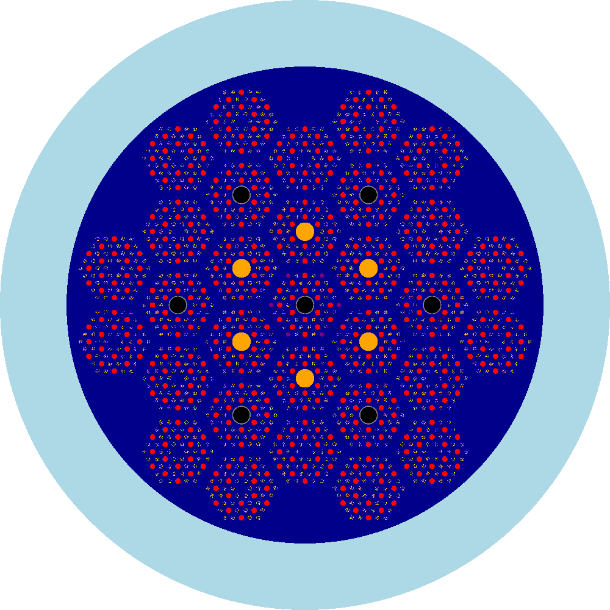
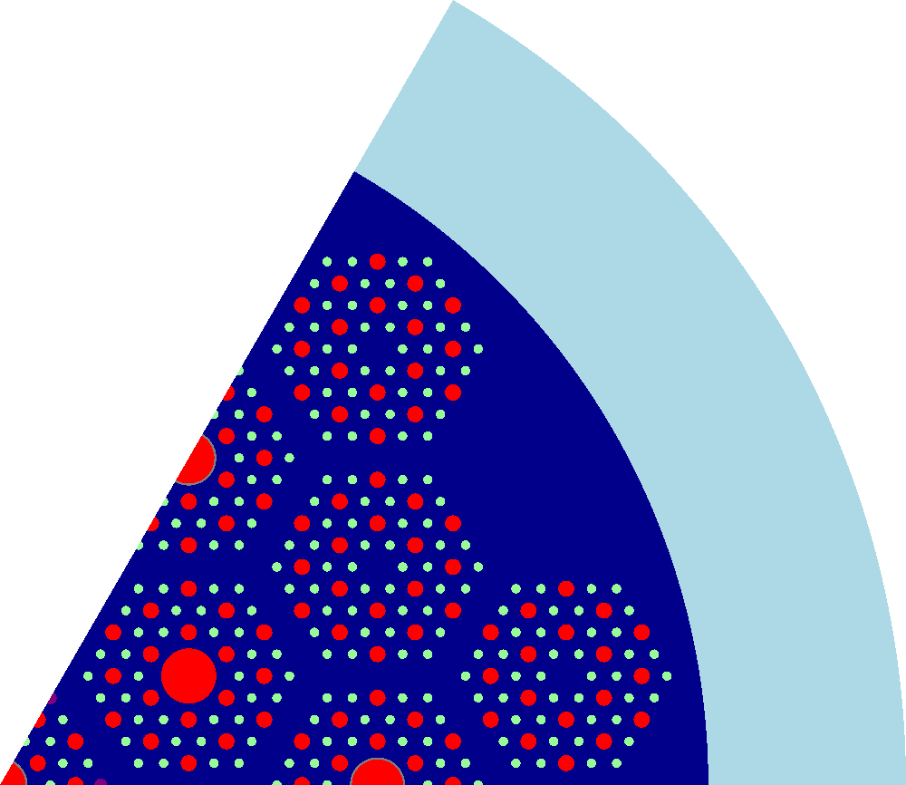
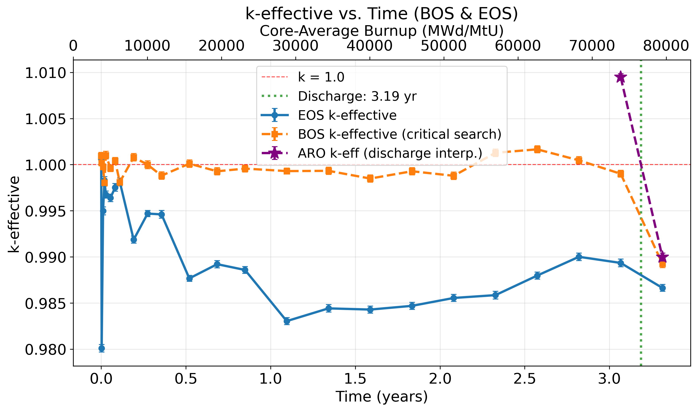
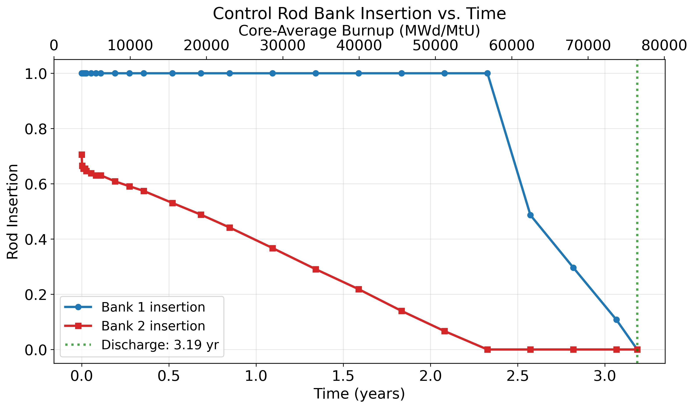
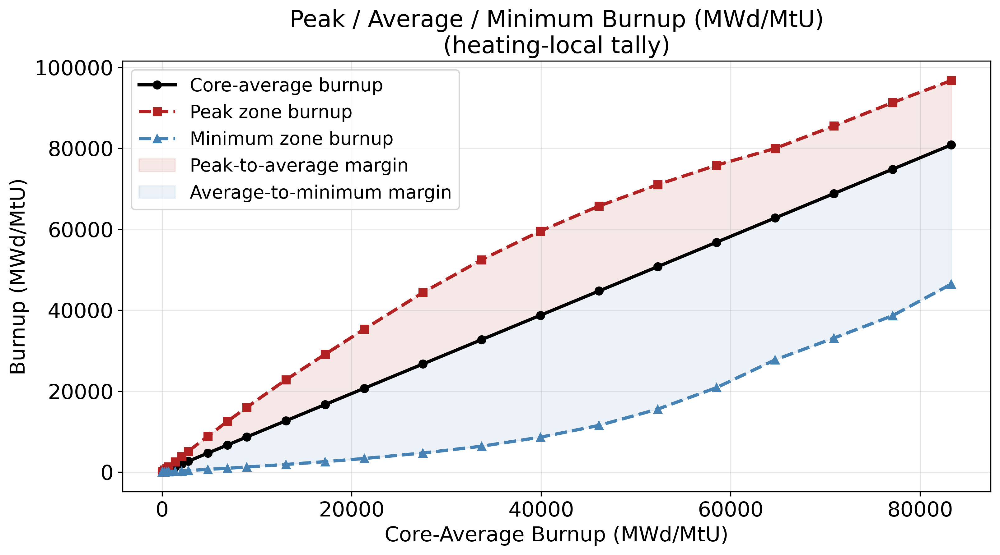
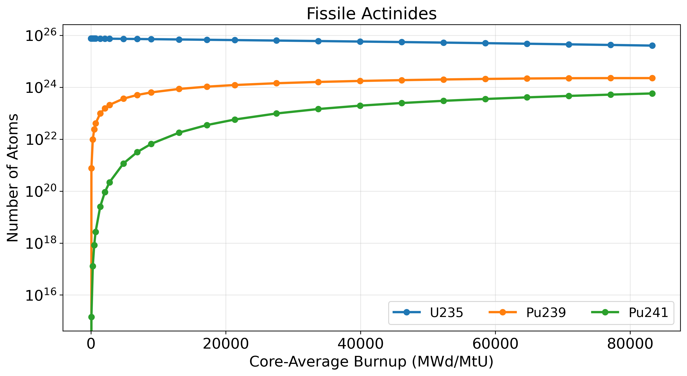
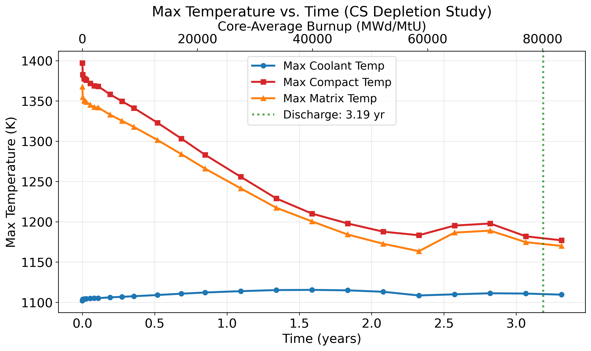
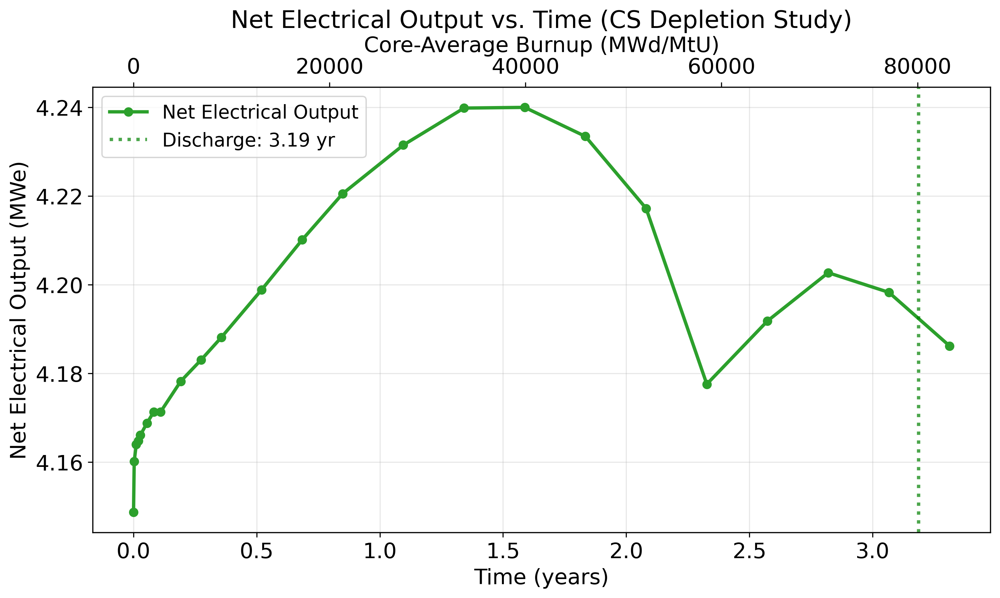

# MicroHTGR

**A modular OpenMC framework for full-core neutronics, criticality search, spatially resolved depletion, and coupled neutronics/thermal-hydraulics analysis of prismatic high-temperature gas-cooled reactors.**

[](LICENSE)
[](https://openmc.org/)
[](https://www.python.org/)
[-lightgrey.svg)](NOTICE.md)

<p align="center">
  
</p>

<p align="center"><em>A full-core prismatic HTGR built entirely from a parameter file — plotted directly by the framework.</em></p>

---

## Contents

- [What this is](#what-this-is)
- [The core idea: the reactor lives in a config file](#the-core-idea-the-reactor-lives-in-a-config-file)
- [Capabilities](#capabilities)
- [Installation](#installation)
- [Quick start](#quick-start)
- [Study modes](#study-modes)
- [Building a different reactor](#building-a-different-reactor)
- [Coupled neutronics / thermal-hydraulics](#coupled-neutronics--thermal-hydraulics)
- [Post-processing](#post-processing)
- [Worked example: the CHUDR microreactor](#worked-example-the-chudr-microreactor)
- [Repository layout](#repository-layout)
- [Attribution and license](#attribution-and-license)
- [Citing this work](#citing-this-work)
- [Acknowledgements](#acknowledgements)

---

## What this is

MicroHTGR is a research framework for analysing **prismatic (block-type) high-temperature gas-cooled reactors** with [OpenMC](https://openmc.org/). It takes a reactor described as a dictionary of parameters and produces a full Monte Carlo transport model, runs one of seven study types against it, and post-processes the results into figures and data files without further intervention.

It was written to answer the questions a fuel cycle and safety analysis actually needs to answer:

- Where do the control rods have to sit for the core to be exactly critical, at every point in life?
- What is the burnup distribution across the core, not just its average?
- What are the fuel, moderator and isothermal temperature coefficients, and do they stay negative?
- What temperatures does the fuel actually reach, once the power shape and the coolant temperature are solved *consistently* rather than assumed?
- How much fast fluence does the reflector accumulate before it has to be replaced?
- What is the shutdown margin with one rod stuck out?

It was developed for, and validated against, a 10 MWth microreactor design (see [Worked example](#worked-example-the-chudr-microreactor)) — but nothing in the framework is specific to that reactor.

## The core idea: the reactor lives in a config file

Almost every published reactor physics script is written for one reactor. Change the core and you rewrite the geometry code.

Here, the geometry is **generated** from a description. A core is a list of concentric rings of assemblies, each named by a short code:

```python
"core_rings": [
    ["rr", "f", "f"] * 6,    # Outer ring: reflector, fuel, fuel — repeated 6×
    ["f", "fc2"] * 6,        # Next ring in: fuel alternating with bank-2 control assemblies
    ["fss"] * 6,             # Fuel assemblies with reserve shutdown tubes
    ["fcp1"],                # Centre: fuel + bank-1 control rod + burnable poison
],
```

That layout, plus the parameters around it, is the entire core definition. The framework expands it into hexagonal lattices, axially zoned universes, TRISO particle lattices, control rod channels with continuously positioned absorber, poison rods, reflector regions and tally meshes.

The available assembly codes:

| Code | Assembly |
|---|---|
| `f` | Fuelled, no rods |
| `fp` / `fpa` | Fuelled with 6 corner burnable poison rods / 1 central poison rod |
| `fc1` `fc2` `fc3` | Fuelled with a central control rod on bank 1, 2 or 3 |
| `fcp1` `fcp2` `fcp3` | Fuelled with a central banked control rod **and** 6 corner poison rods |
| `fss` / `fssp` | Fuelled with a central reserve shutdown tube (optionally + poison rods) |
| `rr` | Reflector block |
| `r1` `r2` `r3` | Reflector block with a central banked control rod |
| `ra1` `ra2` `ra3` | Reflector block with 3 control rods in a hexagonal ring *(1/6 geometry only)* |
| `rss` / `rssa` | Reflector block with 1 / 3 reserve shutdown tubes |

Everything else — enrichment, TRISO layer thicknesses, packing fraction, compact and coolant channel dimensions, lattice and bundle pitch, core height, axial zoning, reflector material and thickness, absorber enrichment, rod bank assignments, depletion schedule, tally configuration, Monte Carlo settings — is a key in the same dictionary.

**Consequence:** a wide range of prismatic HTGR cores can be analysed without touching the source. Fort St. Vrain-style large cores, INL HTGTR-derived layouts, compact micro-assembly cores, graphite- or BeO-reflected, single- or multi-bank, poisoned or clean. Additional assembly geometries can be added to the code as well, allowing for further modularity in core design.

## Capabilities

| | |
|---|---|
| **Transport** | Full-core or 1/6-symmetric hexagonal geometry, explicit TRISO particle lattices, packed-sphere absorber lattices |
| **Double heterogeneity** | Reactivity-equivalent Physical Transform (RPT) with an automated calibration mode that solves for the transform radius against an explicit-TRISO reference |
| **Criticality search** | Binary search on control rod insertion to a user-set `k_eff` tolerance, with continuous (not zone-snapped) rod positions |
| **Depletion** | Spatially resolved burnup on a radial × axial zone map, reduced-chain generation, graphite depletion, restart from a partial run |
| **Rod-following depletion** | Criticality search re-run at *every* depletion timestep, so the core is depleted at its true critical rod position throughout life |
| **Multiphysics** | Converged neutronics ↔ single-channel thermal-hydraulics iteration on both `k_eff` and the axial heating profile |
| **Reactivity coefficients** | FTC, MTC and ITC by direct perturbation, at beginning, middle or end of life |
| **MOL/EOL analysis** | Re-analyse any depletion step — coefficients, heat maps, leakage spectra — without re-running the depletion |
| **Post-processing** | Nine modules producing burnup, isotopics, peaking, spectra, reflector fluence, power cycle output and parametric summaries |

## Installation

OpenMC is distributed through conda-forge, so conda (or mamba) is the supported route:

```bash
git clone https://github.com/c-finney/MicroHTGR.git
cd MicroHTGR
conda env create -f environment.yml
conda activate microhtgr
```

If you already have OpenMC installed by another means, [`requirements.txt`](requirements.txt) covers the remaining dependencies.

### Cross-section data

The framework needs a continuous-energy cross-section library and a depletion chain. Neither is bundled. Download them from the [OpenMC data library page](https://openmc.org/official-data-libraries/) — ENDF/B-VIII.0 is what the reference results used — then point the framework at them:

```bash
export OPENMC_CROSS_SECTIONS="/path/to/endfb-viii.0-hdf5/cross_sections.xml"
export OPENMC_DEPLETION_CHAIN="/path/to/chain_endfb81_thermal.xml"   # optional
export MICROHTGR_OUTPUT_DIR="/path/to/output"                        # optional
```

Only `OPENMC_CROSS_SECTIONS` is required. The depletion chain defaults to a file alongside the cross-section library, and output defaults to `../MicroHTGR_Output` beside the repository. There are **no absolute paths anywhere in this repository** — everything resolves from these three variables.

> **Thermal scattering:** the graphite materials use the `c_Graphite` S(α,β) treatment. Your library must include it, or thermal HTGR results will be badly wrong.

## Quick start

Run a single steady-state eigenvalue calculation on the shipped core:

```bash
# In config.py, set:  "study_execution_mode": "SingleStudy"
python main_simulation.py
```

Output lands in a timestamped directory, `htgr_run_MM.DD.YYYY_HH.MM.SS/`, containing the OpenMC inputs, statepoints, geometry plots, a `run_params.json` snapshot of every parameter used, and a post-processed results folder.

To reproduce the full reference fuel cycle analysis:

```bash
cp examples/chudr_cs_depletion_config.py config.py    # back up your own config.py first
python main_simulation.py
```

That example is documented inline and is the configuration behind every figure below. **It is a large calculation** — read the cost note at the top of the file before starting it.

## Study modes

Set `study_execution_mode` in `config.py`:

| Mode | What it does |
|---|---|
| `SingleStudy` | One steady-state eigenvalue calculation of the configured core. |
| `ParametricStudy` | Sweeps any single parameter across a list of values, runs each case, and aggregates them into comparison plots. Used for pitch optimisation, reflector thickness scans, rod worth curves. |
| `ReactivityStudy` | FTC, MTC and ITC by direct perturbation across a set of ΔT values. |
| `CriticalSearch` | Inserts bank 1 fully, then binary-searches bank 2 until the core is critical. |
| `DepletionStudy` | All-rods-out depletion over the configured timestep list. |
| `CSDepletionStudy` | Depletion with a **criticality search at every timestep** — rods follow reactivity down as the fuel burns — optionally with thermal-hydraulic coupling at each step. |
| `RPTCalibration` | Runs an explicit-TRISO reference, then Illinois regula falsi on the RPT radius until the homogenised model reproduces the explicit `k_eff`. |

`mol_eol_analysis.py` runs separately against a completed depletion directory, reading depleted compositions straight out of `depletion_results.h5` and injecting them into a fresh model build. That means middle- and end-of-life reactivity coefficients, heat maps and leakage spectra cost one eigenvalue solve each, not a re-run of the fuel cycle.

## Building a different reactor

A worked change — converting a BeO-reflected, poisoned core into a graphite-reflected core with a different rod pattern and 15.5% enrichment:

```python
params = {
    "enrichment": 0.155,               # was 0.1975
    "triso_pf": 0.40,                  # was 0.33
    "use_BeO_reflector": False,        # graphite radial reflector instead
    "core_rings": [
        ["rr"] * 18,                   # solid reflector ring
        ["f", "f", "r1"] * 4,          # fuel with bank-1 rods in the reflector blocks
        ["f"] * 6,
        ["fc2"],                       # central bank-2 rod
    ],
    "n_ax_zones": 30,                  # was 50
    "use_1/6_geometry": False,         # model the whole core
    ...
}
```

No other file changes. Re-run `RPTCalibration` afterwards if you use the homogenised fuel treatment, since the transform radius depends on compact geometry, packing fraction and enrichment.

Things worth knowing when you do this:

- `ax_zones_per_burnup_region` must divide `n_ax_zones` exactly.
- `ra*` and `rssa*` assembly codes only work in 1/6 geometry.
- With `use_homogenized_fuel = True` and an uncalibrated `rpt_radius`, results will be wrong in a way that looks plausible. Calibrate, or set it to `False` and model particles explicitly.
- `BeO_thickness` is clamped so the reflector cannot extend past `core_radius`.

## Coupled neutronics / thermal-hydraulics

Assuming a cosine power shape and a linear coolant temperature rise is the standard shortcut, and it is wrong in exactly the place it matters most — a rodded core has a strongly distorted axial power profile, and the fuel temperature feedback depends on it.

This framework closes the loop instead. `th_coupler()` in `mol_eol_analysis.py` iterates:

1. Solve the eigenvalue problem at the current temperature field.
2. Extract the axial heating profile from the mesh tally, for the hottest and average channels.
3. Feed that profile to the single-channel solver ([`ThermalHydraulics/nc_htgr.py`](ThermalHydraulics/nc_htgr.py)), which solves the coolant enthalpy rise, convective film drop, graphite conduction and compact/kernel temperatures node by node, and closes a recuperated Brayton cycle.
4. Map the resulting coolant, compact and matrix temperatures back onto the OpenMC axial zones.
5. Repeat until **both** `k_eff` and the heating profile converge.

In `CSDepletionStudy`, this runs inside the criticality search at every depletion timestep.

Four temperature sources are selectable through `temp_profile_source`, so the expensive coupling is opt-in:

| Source | Use for |
|---|---|
| `THCoupling` | Converged multiphysics. The accurate, expensive option. |
| `IdealProfile` | Cosine/linear analytic profile from `config.py` min/max values. Good for scoping. |
| `Isothermal` | One temperature everywhere. Benchmarking and code-to-code comparison. |
| `FromCSV` | Reuse a converged profile from a previous coupled run. Near-free, and the right choice for parameter sweeps where the temperature field barely moves. |

## Post-processing

Runs automatically unless `run_post_processing` is disabled; each module also works standalone against a finished run directory.

| Module | Produces |
|---|---|
| `burnup_estimation` | Cycle length, `k_eff`, leakage fraction, uranium mass and fuel volume (analytic, no stochastic volume calculation) |
| `depletion_postprocessing` | `k_eff` and rod position histories, nuclide inventories by group, discharge burnup, conversion ratio, fissile inventory ratio, B-10 burnout, per-step net electrical output |
| `heating_profile_extraction` | Hottest- and average-channel axial heating profiles, integrated heating maps, peaking factors |
| `tally_plotter` | Flux, fission rate and heating distributions in XY / XZ / YZ |
| `spectrum_thermalization` | Energy spectrum per unit lethargy, thermal/epithermal/fast fractions, thermalization metrics |
| `leakage_spectrum` | Leakage spectra and absolute rates across every core boundary |
| `BeO_depletion_postprocessing` | Reflector peak and area-averaged fast flux and cumulative fluence vs. burnup |
| `reactivity_coefficients_postprocessing` | Coefficient plots and tabulated results |
| `parametric_postprocessing` | Cross-case comparison plots and summary tables for a parameter sweep |

Every run directory also carries `run_params.json` — a complete snapshot of the parameters that produced it, which is what makes results reproducible and what `mol_eol_analysis.py` reads to reconstruct a model.

## Worked example: the CHUDR microreactor

The framework was developed for **CHUDR** (Compact Helium-cooled Universal Defense Reactor), a 4 MWe / 10 MWth transportable prismatic HTGR designed as a senior design project at the University of Florida and entered in the ANS Student Design Competition. Everything below is output of this repository, from the configuration in [`examples/chudr_cs_depletion_config.py`](examples/chudr_cs_depletion_config.py).

CHUDR is 31 fuel assemblies, 7 control rod positions, 6 reserve shutdown tubes and 6 burnable poison rods inside a 20 cm BeO radial reflector, fuelled with 19.75% HALEU UCO TRISO at a packing fraction of 0.33.

### Geometry

<p align="center">
  
  
</p>

<p align="center"><em>Left: radial material plot of the 1/6 sector actually simulated. Right: axial section. Both plotted by the framework at build time.</em></p>

### Rod-following depletion

<p align="center">
  
  
</p>

The left plot is the point of the whole `CSDepletionStudy` mode. The orange beginning-of-step curve is pinned to `k = 1.000` across 3.19 years because the criticality search re-solves the rod position at every timestep; the blue end-of-step curve is the reactivity actually consumed by each burn interval. Cycle length is then set by where the all-rods-out core drops to critical.

### Fuel cycle and isotopics

<p align="center">
  
  
</p>

Spatially resolved depletion gives peak and minimum channel burnup, not just the core average — which is what actually has to be checked against the TRISO fuel limit.

### Coupled thermal-hydraulics

<p align="center">
  
  
</p>

Because the temperature field is converged against the true rodded power shape at every step, peak fuel temperature is not monotonic — it dips at middle of life as rod withdrawal flattens the axial profile, then recovers as radial peaking grows. An assumed cosine profile cannot show this.

### Reference results

| Quantity | Value |
|---|---|
| Cycle length (once-through) | 3.19 years |
| Average discharge burnup | 80,098 MWd/MtU |
| Peak / minimum channel burnup | 91,276 / 38,639 MWd/MtU |
| Isothermal temperature coefficient | −7.81 pcm/K (BOL) → −6.35 pcm/K (EOL) |
| Shutdown margin, all rods in | 13,334 ± 19 pcm |
| Shutdown margin, one stuck rod | 8,286 ± 18 pcm |
| Shutdown margin, reserve system | 5,928 ± 17 pcm |
| Net electrical output | 4.15 – 4.24 MWe across the cycle |
| BeO reflector lifetime fast fluence | 5.07 × 10²⁰ n/cm² |

The RPT homogenisation used for the depletion runs was validated against explicit-TRISO modelling: discharge burnup agreed to within 2.5%, with isotopic errors below 1% for every actinide and fission product of interest.

## Repository layout

```
MicroHTGR/
├── main_simulation.py          Entry point. Model build + all seven study modes.
├── config.py                   THE reactor definition. Path config, all parameters.
├── materials.py                OpenMC material definitions, built from config.
├── assembly.py                 Assembly universes and core lattice construction.
├── trisos.py                   TRISO particle packing and lattice construction.
├── b4c_spheres.py              Reserve shutdown B4C sphere packing and lattice.
├── reactivity_coefficients.py  FTC / MTC / ITC by direct perturbation.
├── mol_eol_analysis.py         MOL/EOL re-analysis + the N-TH coupler.
│
├── ThermalHydraulics/          Single-channel TH + Brayton cycle solver
│   ├── nc_htgr.py                (see NOTICE.md — originates from HTGR-SCAPC)
│   ├── nc_input.csv              TH and power cycle input deck
│   └── neutronics.csv            Example axial heating profile
│
├── PostProcessingScripts/      Nine analysis and plotting modules
│
├── examples/
│   └── chudr_cs_depletion_config.py    Reference coupled CS-depletion run
│
├── docs/figures/               Figures used in this README
├── licenses/CC-BY-4.0.txt      Licence text for the derived VTB material
├── LICENSE                     MIT
├── NOTICE.md                   Required third-party attribution
└── CITATION.cff                Citation metadata
```

Roughly 16,000 lines of Python. Simulation output is written outside the repository — see [Cross-section data](#cross-section-data).

## Attribution and license

This repository is released under the **[MIT License](LICENSE)**.

It contains material derived from work by others, and redistribution requires carrying that attribution forward. **[`NOTICE.md`](NOTICE.md) is the authoritative statement** — the summary here is not a substitute for it.

- **NRIC Virtual Test Bed, prismatic HTGR assembly model** — [`htgr/assembly`](https://github.com/idaholab/virtual_test_bed/tree/main/htgr/assembly), [documentation](https://virtualtestbed.inl.gov/htgr/assembly/index.html). Licensed **[CC BY 4.0](licenses/CC-BY-4.0.txt)**. The material definitions in `materials.py`, the prismatic assembly parameterisation in `config.py`, and the assembly construction approach in `assembly.py` are derived from it. **This repository is a modified derivative and is not the VTB model**; `NOTICE.md` lists the changes. Neither INL, NRIC, nor the DOE endorses or has reviewed this work.

- **HTGR-SCAPC** by **Bryan Huynh** — [github.com/bryanhhuynh/HTGR-SCAPC](https://github.com/bryanhhuynh/HTGR-SCAPC). `ThermalHydraulics/nc_htgr.py` originates from this project and is included **with the author's permission**, with the modifications listed in `NOTICE.md`.

- **OpenMC** — MIT-licensed, developed by MIT and contributors. A dependency, not a derivative.

## Citing this work

If this framework is useful in your research, please cite it via [`CITATION.cff`](CITATION.cff) (GitHub's "Cite this repository" button will format it for you), and cite the VTB model and OpenMC alongside it — both are listed as references in that file.

## Acknowledgements

The CHUDR design that this framework was built to analyse was produced by a six-person senior design team in the ENU 4192 course at the University of Florida: **Cade Finney, Evan Alder, Bryan Huynh, Colin Frazier, William St. Peter** and **Daniel Fernandez**, under the guidance of **Dr. DuWayne Schubring** and the faculty of the Department of Materials Science & Engineering, Nuclear Engineering Program.

Thanks to the OpenMC development team, and to Idaho National Laboratory and NRIC for publishing the Virtual Test Bed openly — having a credible, open prismatic HTGR reference model to build from is the reason this project could start where it did.
